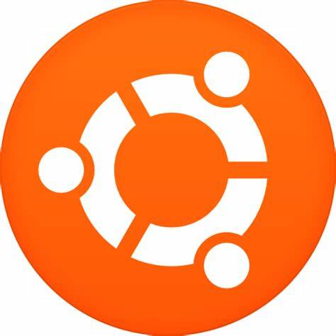

<h1 align="left" id="macropower-title">:wave: Hello there! I'm Caiooooo</h1>

  
  
  
  
  
  

- 🏢 &nbsp;I'm currently working as **Quant trader**
- 💬 &nbsp;I like to talk about **develop** and **[games](https://steamcommunity.com/profiles/76561199273584463/)**
- 📖 &nbsp;Learn more about my projects on my **[blog](https://buttonwood.cn)**
- 📫 &nbsp;Ask me anything on my **[issues page][issues page]**
- 💻 &nbsp;Connect with me on **[WeChat](https://buttonwood.cn/buttonwood.html)**

 

<h2 align="left" id="macropower-tech">Favorite Tech</h2>

> Tools, languages, and other things that I like to work with.

<table>
  <tr>
    <td align="center" width="96">
      
       Rust
    </td>
    <td align="center" width="96">
      
       Python
    </td>
    <td align="center" width="96">
      
       FFmpeg
    </td>
    <td align="center" width="96">
      
       JavaScript
    </td>
    <td align="center" width="96">
      
       Kubernetes
    </td>
    <td align="center" width="96"> 
      
       Docker
    </td>
    <td align="center"  width="96">
      
       Ubuntu
    </td>
    <td align="center" width="96">
      
       Grafana
    </td>
  </tr>
</table>

<h2 align="left">Coding Activity</h2>

> Total logged open-source coding time since 2020-07-19. Updated every 1 hour.

[84.51°]: https://github.com/8451
[issues page]: https://github.com/MacroPower/MacroPower/issues
[linkedin]: https://www.linkedin.com/in/colvinjm
[homelab]: https://github.com/MacroPower/homelab
[blog]: https://buttonwood.com/
